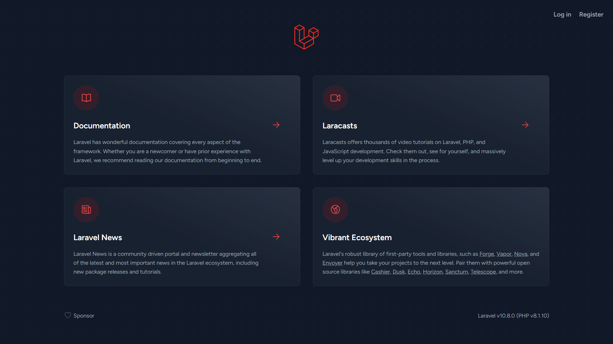
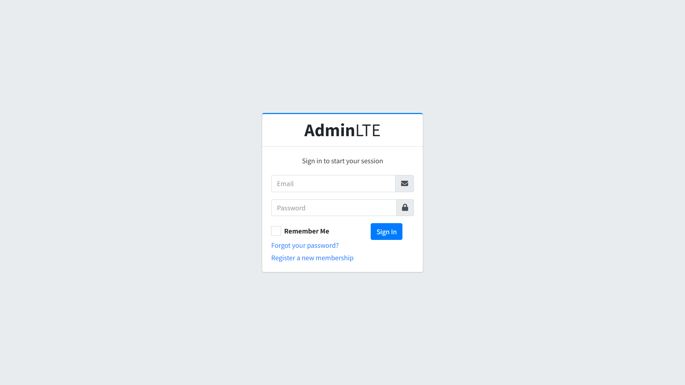
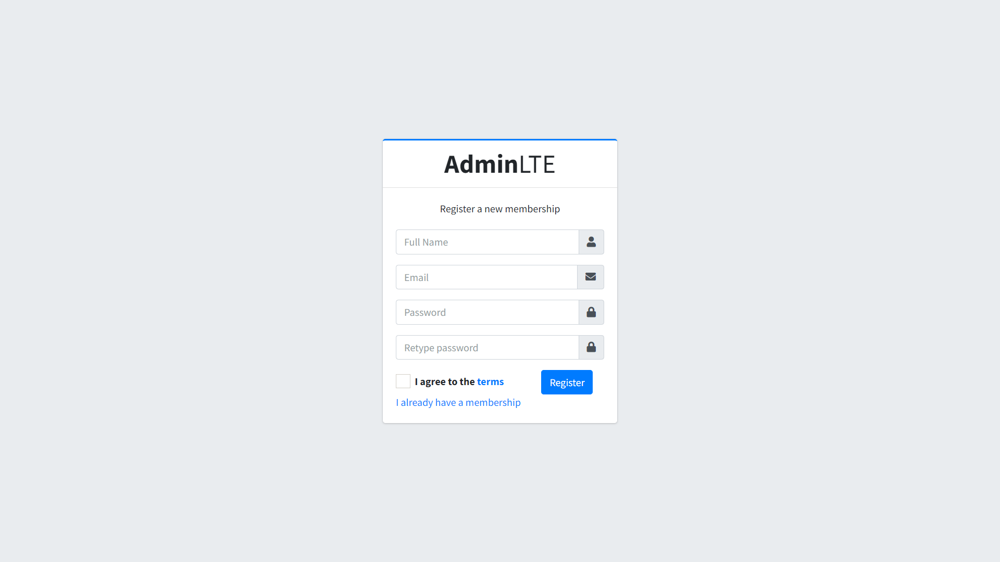
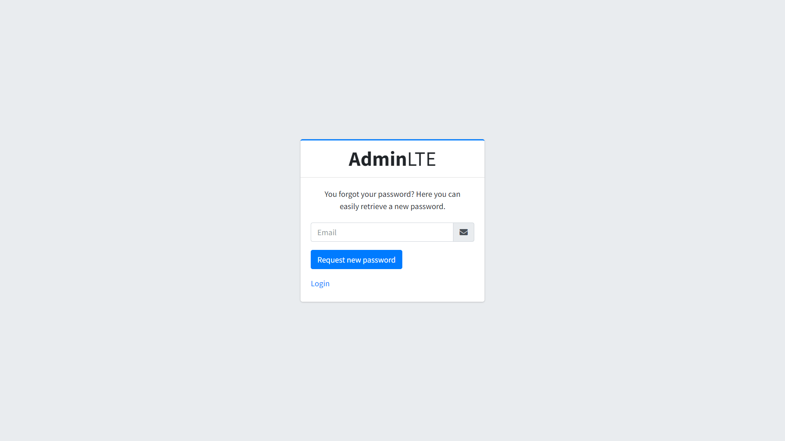
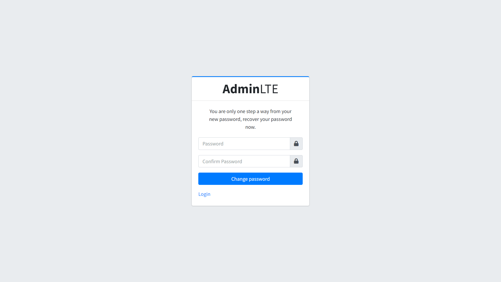
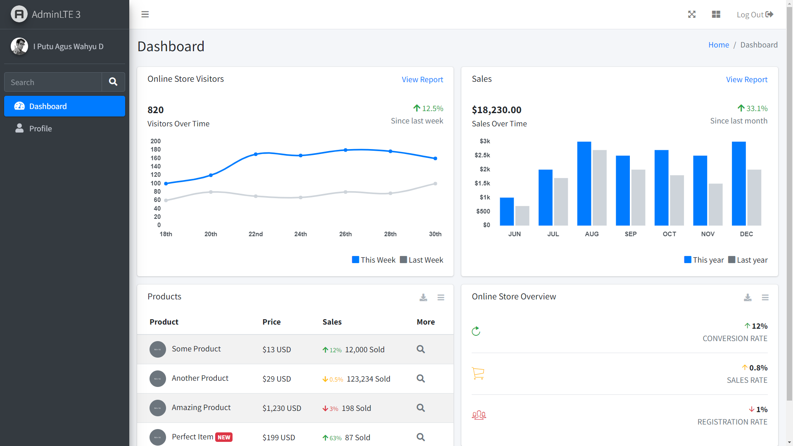
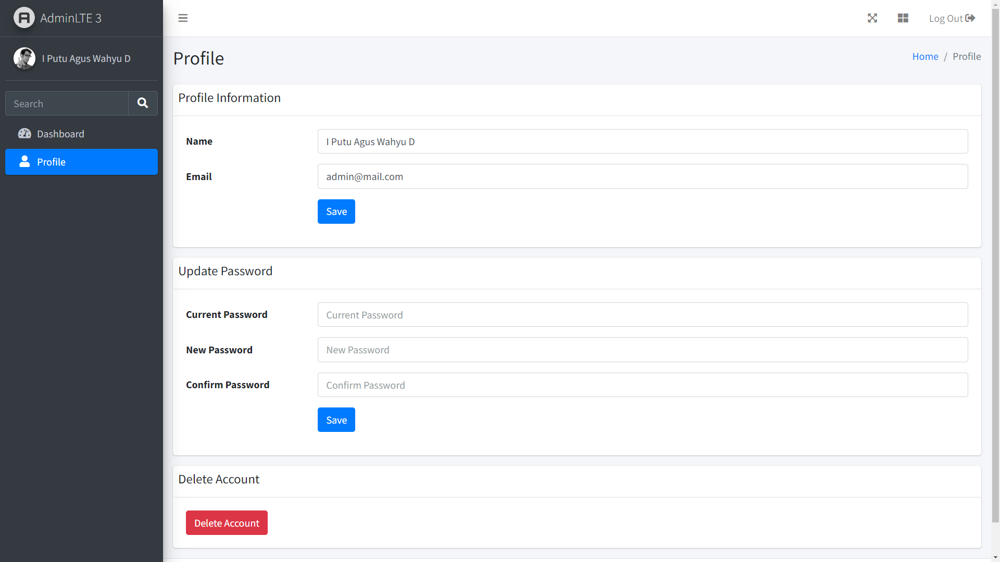

# Laravel Breeze Blade + AdminLTE 3

This project is an example of using Laravel Breeze Blade with AdminLTE 3.

## Requirements

-   PHP >= 8.1
-   Laravel >= 10.x
-   Breeze >= 1.x

The above requirements follow the time of establishment of this project

## Installation

1. Install laravel first. Documentation can be found in [Laravel](https://laravel.com/docs/10.x)
2. Install Laravel Breeze Blade. Documentation can be found in [Laravel Breeze Blade](https://laravel.com/docs/10.x/starter-kits)
3. Copy and overwrite the public and resources folders of this project to your project.
4. The AdminLTE 3 template can already be used.

## Screenshots

-   Welcome Page
    

-   Login Page
    

-   Register Page
    

-   Forgot Password Page
    

-   Reset Password Page
    

-   Dashboard Page
    

-   Profile Page
    

## About

Template source : [AdminLTE 3](https://adminlte.io/themes/v3/)

License : [MIT](https://opensource.org/licenses/MIT)
